 

## 🧩 Core & Frontend

## ⚙️ Backend & Data

 

## ☁️ Cloud, DevOps & Tooling

 

## 🏛️ Architecture & Engineering Practices

 

---

## 🚀 Project Showcase

<table align="center">
  <tr>
    <td width="50%">
      <h3 align="center">Leko</h3>
      
The first social network for athletes, coaches and local communities — connecting beginners and professionals with the right training partners and the tools to reach real results. Delivered as a cross-platform mobile product.

      

		  

          
        
      

    </td>
    <td width="50%">
      <h3 align="center">Ignite Starter</h3>
      
A scalable fullstack monorepo starter that lets teams bootstrap new products on a production-oriented baseline — web, API, database, email, testing and CI/CD pre-wired and ready to extend.

      

        
        
        
        
        
        
          
        
      

    </td>
  </tr>
  <tr>
    <td width="50%">
      <h3 align="center">Next Starter</h3>
      
A single Next.js application with server actions, Prisma-backed PostgreSQL, Better Auth, Stripe billing and React Email templates — platform concerns centralized while features remain isolated in their own modules.

      

        
        
        
        
        
          
        
      

    </td>
    <td width="50%">
      <h3 align="center">C.I.O.S</h3>
      
A platform for tracking the entry and exit of IT equipment, maintaining a reliable audit trail of these movements and associating each one with the responsible employee.

      

        
        
          
        
      

    </td>
  </tr>
</table>

---

<h3 align="left">GitHub Stats</h3>

		

 

  

 
 
  - Badges by <a href="https://home.aveek.io/GitHub-Profile-Badges/">GitHub-Profile-Badges</a> 
  - GitHub Stats by <a href="https://github.com/anuraghazra/github-readme-stats">anuraghazra</a>
  - Developer vector created by <a href="https://www.freepik.com/vectors/developer">storyset - www.freepik.com</a> (edited by author)
 
  
Made by <a href="https://github.com/williamelesbao">WE</a>.

